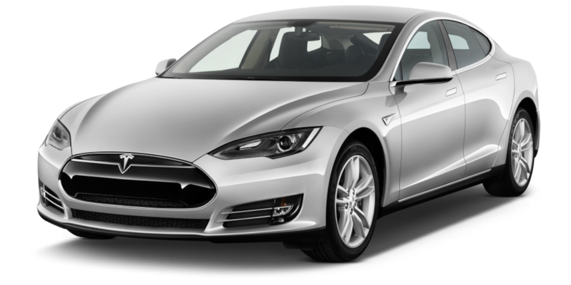
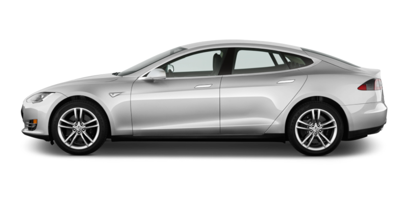
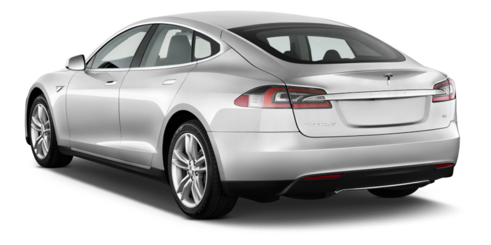
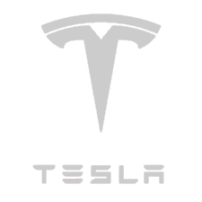
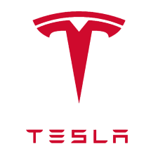

# Ride hailing cars

Small non exhaustive dataset of ride hailing cars in circulation on platforms like Uber, FREE NOW or Bolt between 2018 and 2019 in Paris, France. Content is part English part French.

## Dataset

### CSV Sources Files

* [vehicle-models.csv](dataset/vehicle-models.csv)
* [vehicle-variants.csv](dataset/vehicle-variants.csv)
* [platforms.csv](dataset/platforms.csv)

### Json Exports Files

* [cars.json](dataset/cars.json) cars variants, models and related platform categories
* [ride-hailing.json](dataset/ride-hailing.json): ride hailing platforms and categories
* [brands.json](dataset/brands.json)

### Vehicles models and variants

Column Name | Notes
----------- | -----
variant's `id` | integer
`modelId` | integer
`modelFullName` | string
variant's `name` | string
`leather` | `0` / `false` or `1` / `true`
`gearbox` | `Manual` or `Automatic`
`engine` | `Combustion`, `Hybrid`, `Electric` or `Hydrogen`
`fuel` | if engine is `Combistion`: `Diesel` or `Petrol`
`fuelTankSize` | litters (decimal)
`fuelMixt` | mean consumption in L/100km (decilmal)
`fuelUrban` | mean consumption in L/100km while in town (decilmal)
`batteryVoltage` | integer
`batteryAutonomy` | max mileage using battery (integer)
`horsePower` | integer
`horsePowerFiscal` | french fiscal reference approx. (integer)
`brandId` | integer
`brandName` | stirng
model's `name` | string
`type` | car category: `berline`, `break`, `city`, `suv` or `access`
`fullName` | string

Picture Preview | Link
------- | ----
 | `images/vehicle-models/${modelId}/0.png`
 | `images/vehicle-models/${modelId}/1.png`
 | `images/vehicle-models/${modelId}/2.png`

### Platforms

Column Name | Notes
----------- | -----
`id` | integer
`ridehailingId` | integer
`ridehailingName` | string
`rank` | integer for sorting purpose
`name` | string
`genericClass` | some sort of generic car class common to all platforms: `economic`, `green`, `berline` and `van`

### Manufacturer brands

Picture Preview | Link
------- | ----
 | `images/brand/icons-gray/${brandId}.png`
 | `images/brand/icons-red/${brandId}.png`
 | `images/brand/logos-gray/${slug}.png`
 | `images/brand/logos-red/${slug}.png`

## Notes

* Provided pictures are bad quality but sufficient to use as placeholders
